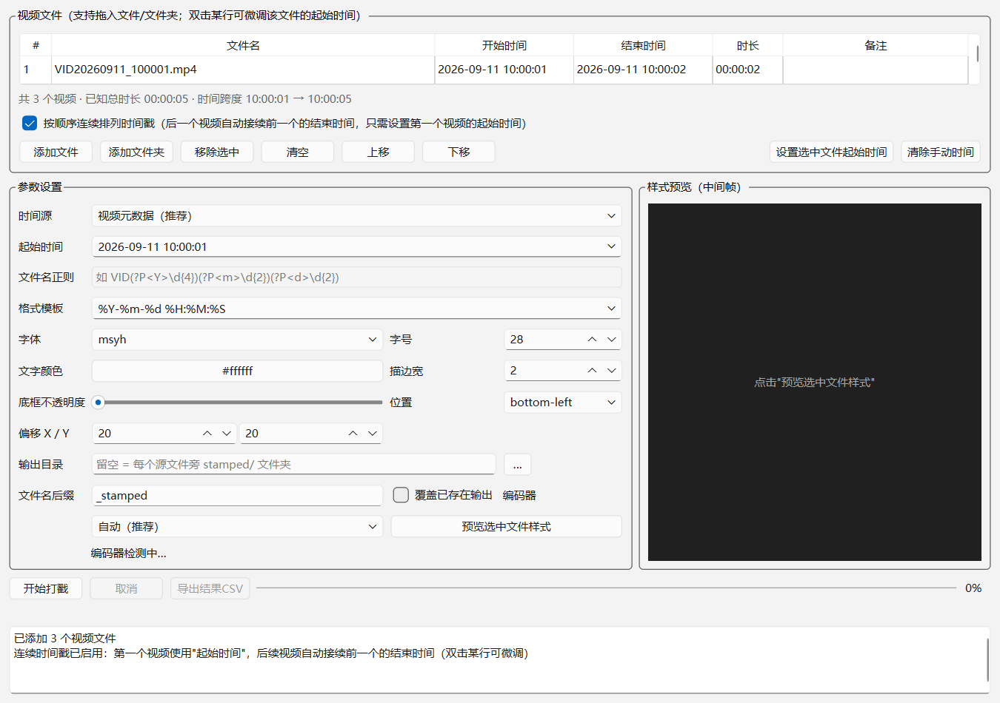

# VideoStamp - 视频批量加时间戳

给一批视频按顺序烧录**日期时间水印**的 Windows 桌面工具：只需设置第一个视频的开始时间，后续视频自动接续前一个的结束时间依次连续排列。适合监控录像、执法记录仪、会议录制等需要逐段标注真实时间的场景。

> Batch-burn datetime watermarks into a folder of videos, with automatic back-to-back timestamps: set the start time of the first clip, and every following clip continues where the previous one ended.



## 功能特性

- **顺序连续时间戳**：按导入顺序，后一个视频的起始时间 = 前一个视频的结束时间（开始 + 时长），只需设置第一个视频的时间；表格实时预览每个视频的开始/结束时间与总时长
- **手动微调**：双击列表某一行可为单个视频重新指定起始时间，其后的视频自动顺延
- **四种时间源**：视频元数据（拍摄设备写入的 creation_time）/ 文件创建时间 / 手动指定 / 文件名正则提取
- **输出规格与源一致**：H.264 源 → H.264 输出，HEVC 源 → HEVC 输出；容器、分辨率、帧率、时长保持不变（个别不兼容容器自动回退 mp4），10bit HEVC 保留位深
- **硬件加速**：自动探测并优先使用 NVIDIA NVENC / Intel QSV / AMD AMF，失败自动回退 CPU（x264/x265）
- **样式可定制**：字体/字号/颜色/描边/半透明底框/九宫格位置/偏移，支持实时单帧预览
- **便携免安装**：PyInstaller 打包为绿色文件夹，无需安装 Python/FFmpeg，拷贝即用
- **批量报告**：处理完成可导出 CSV 清单（状态/时间来源/编码器/错误原因）

## 快速开始

### 方式一：下载打包好的 EXE（推荐普通用户）

从 [Releases](../../releases) 下载 `VideoStamp.zip`，解压后双击 `VideoStamp.exe` 即可，详见 [离线安装与验证指南](docs/离线安装与验证指南.md)。

### 方式二：从源码运行（Windows 10/11, Python 3.10+）

```bat
git clone https://github.com/<your-username>/VideoStamp.git
cd VideoStamp
pip install -r requirements.txt

:: 获取 FFmpeg 到 videostamp/vendor/ffmpeg/（首次必须）
python tools\fetch_ffmpeg.py

:: 启动图形界面
python run_gui.py

:: 或使用命令行
python run_cli.py --input "D:\videos" --time-mode manual --start "2026-09-11 14:30:00" --dry-run
```

## 命令行示例

```bat
:: 预演（不实际打戳，查看计划与时间解析结果）
VideoStampCLI.exe --dry-run --input D:\videos

:: 手动指定起始时间，批量打戳
VideoStampCLI.exe --input D:\videos --time-mode manual --start "2026-09-11 14:30:00"

:: 从文件名提取时间（命名分组）
VideoStampCLI.exe --input D:\videos --time-mode regex --pattern "VID(?P<Y>\d{4})(?P<m>\d{2})(?P<d>\d{2})_(?P<H>\d{2})(?P<M>\d{2})(?P<S>\d{2})"

:: 强制 CPU 编码 + 导出 CSV 报告
VideoStampCLI.exe --input D:\videos --hw cpu --csv report.csv
```

## 时间源说明

| 模式 | 适用场景 |
| --- | --- |
| 视频元数据（推荐） | 原始拍摄文件，读取设备写入的 creation_time，缺失时自动回退文件创建时间 |
| 文件创建时间 | 文件未被复制/转存过的场景 |
| 手动指定 | 时间信息已被破坏，或需统一指定（配合"顺序连续排列"只需填第一个视频的时间） |
| 文件名正则 | 文件名含时间，如 `VID20260911_143005.mp4`；分组 Y/m/d/H/M/S 必须从 Y 开始连续 |

## 从源码打包 EXE

```bat
pip install -r requirements-dev.txt
python tools\fetch_ffmpeg.py
python -m PyInstaller VideoStamp.spec --noconfirm
:: 产物在 dist\VideoStamp\，整体分发即可
```

## 开发与测试

```bat
python -m unittest discover -s tests -v
```

- 测试覆盖时间解析、滤镜转义、硬件探测回退、格式保持、连续时间戳计算与端到端打戳（需先执行 `tools\fetch_ffmpeg.py`）
- `tools/` 内含 FFmpeg drawtext 语法探测等调试脚本，便于在其他 FFmpeg 版本上排查兼容性

## 项目结构

```
videostamp/
├─ app/        PySide6 图形界面（时间轴表格/预览/批量线程）
├─ core/       核心逻辑（探测/时间源/滤镜构建/硬件探测/执行器/连续时间计算）
├─ cli.py      命令行入口
tools/         FFmpeg 获取、语法探测等辅助脚本
tests/         单元与集成测试
docs/          离线安装与验证指南
run_gui.py / run_cli.py    启动入口
VideoStamp.spec            PyInstaller 打包配置
```

## 常见问题

- **启动提示"未检测到可用 GPU 编码"**：显卡驱动过旧（NVIDIA 需 610+），更新驱动即可；不影响使用，自动改用 CPU
- **时间不对**：文件被复制过会丢失原始拍摄时间，改用"手动指定 + 顺序连续排列"
- **报"模板含不支持的字面冒号"**：格式模板中时分秒用 `%T`（等价 %H:%M:%S）或 `%R` 表示

更多问题见 [离线安装与验证指南](docs/离线安装与验证指南.md)。

## 许可证

本项目代码以 [MIT License](LICENSE) 发布。

分发与本程序绑定的 **FFmpeg 可执行文件**受其自身许可证约束：本项目默认使用的 [BtbN FFmpeg-Builds](https://github.com/BtbN/FFmpeg-Builds)（win64-gpl 构建）包含 x264/x265 等组件，遵循 **GPL v2+** 许可证。再分发附带 ffmpeg.exe 的安装包时，请遵守 GPL 的相应义务（提供来源链接或对应源码）。Qt / PySide6 为 LGPL，PyInstaller 打包符合其豁免条款。

## 致谢

- [FFmpeg](https://ffmpeg.org) — 音视频处理引擎
- [BtbN FFmpeg-Builds](https://github.com/BtbN/FFmpeg-Builds) — Windows 构建
- [Qt / PySide6](https://www.qt.io) — 图形界面框架
